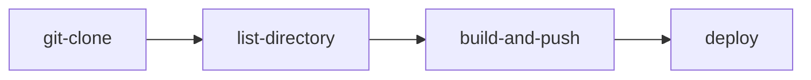

# El Taquito Feo 🌮

### Getting Started

Este repositorio contiene la definición de la aplicación de Taquitos Feos, un listado de tus tacos menos favoritos.

### Contenido

- [Happy Path](#happy-path-)
- [Conoce el área de trabajo](#conoce-el-área-de-trabajo-️)
- [Variables de entorno](#variables-de-entorno-%EF%B8%8F)
- [Utilizando Docker](#utilizando-docker-)
- [Utilizando Kubernetes](#utilizando-kubernetes-️)
- [Utilizando OpenShift](#utilizando-openshift-)
- [It Works!](#it-works-)
- [Recursos API para RECIPES](#recursos-api-para-recipes-)
- [Información de Contacto](#información-de-contacto)

### Version

- Versión: v2
- Descripción: Esta versión muestra uns interfaz gráfica demostrativa y endpoints para los métodos GET, POST y DELETE.

# Happy Path 🥳

1. Utiliza los recursos de Docker, Kubernetes u OpenShift que se proporcionan en este documento y/o modificalos según tus necesidades.
2. Sigue los pasos para desplegar tu app con docker, kubernetes u OpenShift.
3. Verifica que está funcionando desde tu navegador, o
4. Utiliza Postman para consumir los microservicios.

# Conoce el área de trabajo 🗂️

Ubica los recursos dentro de las carpetas de este proyecto y utilizalos según tus necesidades.

```
├── 🗂️ tacos-feos
│   ├── 🐳 Dockerfile
│   ├── 📄 [Recursos de la aplicación]
│   ├── 🗂️ manifest
│   │   ├── 📄 [Recursos Kubernetes]
│   |   ├── 🗂️ open-shift
│   |   |   ├── 📄 [Recursos OpenShift]
```

# Variables de entorno ⚙️

El proyecto es sencillo, por lo que, de momento, únicamente tendrás que especificar el puerto por donde quieres que se ejecute la aplicación.

```yaml
NODE_PORT=3000
```

# Utilizando Docker 🐳

### Nodejs

Para esta versión se está utilizando la imagen de Nodejs en su versión 20.9.0 disponible en [Dockerhub](https://hub.docker.com/layers/library/node/20.9.0/images/sha256-a6759aea6838201fb9b76b3ffccce537c745cef4b76b72c2cec24c50d7fc1ae0?context=explore).

<details>
<summary>💡 ¿Requieres modificar el Dockerfile?</summary>

<p></p>
<p>Si es así, realiza las modificaciones necesarias y vuelve a construir la imagen de docker. Sube la imagen a dockerhub para utilizar tu propia versión:</p>

```bash
$ docker build build -t [USER]/taquito-feo:[TAG] .

$ docker push [USER]/taquito-feo:[TAG]
```

</details>

<details>
<summary>💡 Crea el contenedor Docker.</summary>

<p></p>
<p>Si únicamente requieres usar Docker para ejecutar la aplicación, utiliza el siguiente comando:</p>

```bash
$ docker run --name "taquito-feo" -p 3000:3000 pxrsival/taquito-feo:2.0
```

<p>Pero si actualizaste la variable de entorno no olvides especificarlo en la línea de comandos:</p>

```bash
docker run --name "taquito-feo" -e "NODE_PORT=3001" -p 3001:3001 pxrsival/taquito-feo:2.0
```

</details>

<details>
<summary>💡 Accede a la aplicación.</summary>

<p></p>
<p>Cuando el contenedor se encuentre en ejecución, únicamente deberás acceder a la aplicación desde un navegador o consumiendo los endpoints para verificar que está funcionando correctamente (si actualizaste el puerto de NODE, no olvides actualizarlo también en tu URL).</p>

```bash
http://localhost:3000

http://localhost:3000/recipes
```

</details>

<p></p>

# Utilizando Kubernetes ☸️

Utiliza los recursos proporcionados o modifícalos según tus nececidades. Puedes localizarlos dentro de la carpeta `manifest`.

<details>
<summary>💡 Ver cómo aplicar los recursos de Kubernetes.</summary>

<p></p>

Primero deberás aplicar el `deployment`, luego el `service` y por último el `ingress`.

Ejecuta los siguientes comandos para crear cada recurso:

```bash
$ kubectl apply -f app-deployment.yaml

$ kubectl apply -f app-service.yaml

$ kubectl apply -f app-ingress.yaml
```
</details>

<details>
    
<summary>💡 Verifica que su creación se completó correctamente.</summary>

<p></p>

Ejecuta los siguientes comandos para validar que los `pods`, `service` e `ingress` se han creado correctamente.

```bash
$ kubectl get pods ----> Para verificar los pods.

$ kubectl get services ----> Para validar el service.

$ kubectl get ingress ----> Para validar el ingress.
```
</details>

<details>
<summary>💡 Accede a la aplicación.</summary>

<p></p>

<p>Una vez aplicados todos los archivos YAML deberás acceder a la aplicación desde un navegador o consumiendo los endpoints para verificar que está funcionando correctamente (si actualizaste el puerto de NODE, no olvides actualizarlo también en tu URL).</p>

```bash
http://[URL PROPORCIONADA POR EL INGRESS]:3000

http://[URL PROPORCIONADA POR EL INGRESS]:3000/recipes
```

</details>

<p></p>

# Utilizando OpenShift 🎩

Utiliza los recursos proporcionados o modifícalos según tus nececidades.

Los recursos se encuentran dentro de la carpeta `manifest/openshift`.

```
├── 🗂️ tacos-feos
│   ├── 🗂️ manifest
│   │   ├── 🗂️ openshift
│   │   |   ├── 🗂️ secrets
│   │   |   ├── 🗂️ task
│   │   |   ├── 🗂️ task-runs
│   │   |   ├── 🗂️ pipeline
│   │   |   ├── 🗂️ pipeline-runs
```

## Overview

Lo que buscamos lograr es crear un pipeline que ejecute las siguiente secuencia de tareas para desplegar nuestra aplicación cada vez que ocurra un cambio en Github.



| GIT-CLONE    | LIST-DIRECTORY    | BUILD & PUSH    | DEPLOY    |
| :------- | :------ | :------- | :------ |
| Se clonará el presente repositorio de github en el _namespace_ especificado (user7).     | Listará los documentos usando el comendo `ls`. Servirá para validar que podemos acceder al código clonado en el paso anterior.  | Emplearemos la task BUILDAH para crear y empujar la imagen a Dockerhub. El propósito de este paso es tener una imagen nueva con los últimos cambios aplicados.     | Se desplegará la aplicación creando los recursos necesarios para que podamos acceder a la misma desde internet.  |


## Requisitos específicos

#### ✅ 1. Accede a OpenShift desde tu terminal 💻

> [!IMPORTANT]
> **Debes de tener OC y TKN instalados en tu equipo.**

<details>
<summary>💡 ¿Cómo descargar OC?</summary>

<p></p>

Desde la interfaz web de openShift da clic en el ícono `❓` >> `Command Line Tools` >> `oc - OpenShift Command Line Interface (CLI)`, selecciona la desgarga de acuerdo a tu sistema operativo y realiza la instalación.

</details>

<details>
<summary>💡 ¿Cómo descargar TKN?</summary>

<p></p>

Desde la interfaz web de openShift da clic en el ícono `❓` >> `Command Line Tools` >> `tkn - OpenShift Pipeline Command Line Interface (CLI)`, selecciona la desgarga de acuerdo a tu sistema operativo y realiza la instalación.

</details>

<details>
<summary>💡 ¿Cómo acceder a OpenShift desde la Terminal?</summary>

<p></p>

Desde la interfaz web de openShift da clic en el ícono `❓` >> `Command Line Tools` >> `Copy Login Command` >> `Login` >> `Display Token` y copia el comando:

```bash
oc login --token=[TOKEN QUE SE MUESTRA] --server=[SERVER QUE SE MUESTRA]
```

</details>


#### ✅ 2. Tus credenciales de Docker 🐳

Debido a que utilizaremos la Task `Buildah` necesitamos proporcionar nuestras credenciales de Docker a través de un `secret` para poder acceder a Dcokerhub desde la Task. No te preocupes, nadie tendrá acceso a tus credenciales. 😁

<details>
<summary>💡 [Opción 1] Crea un SECRET con tu usuario y contraseña (token).</summary>

<p></p>

Puedes optar por crear el `secret` directamente con un archivo YAML:

```yaml
apiVersion: v1
kind: Secret
metadata:
  name: mydockerhub # Nombre del secret
  annotations:
    tekton.dev/docker-0: https://gcr.io
type: kubernetes.io/basic-auth
stringData:
  username: DOCKER_USER # Tu usuario de docker
  password: DOCKER_TOKEN # Token que generas desde dockerhub
```

Para crearlo, ejecuta el siguiente comando:

```bash
$ oc create -f secret-docker.yaml
```

Desde la interfaz web, en el apartado correspondient a `secrets` podrás ver listado tu nuevo secreto.

</details>

<details>
<summary>💡 [Opción 2] Crea un SECRET usando el archivo de configurción almacenado en tu equipo (si tienes Docker instalado).</summary>

<p></p>

Si ya tienes Docker instalado, realiza un `$ docker login` para verificar que ya tienes sesión iniciada. Posteriormente ejecuta el siguiente comando para crear el `secret`usando el archivo de configuración `json` que se almacena en tu equipo:

```bash
Ejemplo con ubuntu...

$ oc create secret generic mydockerhub \
--from-file=.dockerconfigjson=/home/clouduser/.docker/config.json \
--type=kubernetes.io/dockerconfigjson
```

</details>

#### ✅ 3. Crea un service account 🔑

La Task BUILDAH necesita una SERVICE ACCOUNT para poder conectarse a nuestro Docker. En OpenShift, una
SERVICE ACCOUNT (cuenta de servicio) es una entidad que permite a los procesos dentro de un pod autenticarse. En este caso requerimos que BUILDAH pueda autenticarse con Dockerhub haciendo uso de nuestro usuario y contraseña.

<details>
<summary>💡 Ver cómo crear una Service Account.</summary>

<p></p>

Crea un archivo `yaml` con el siguiente contenido:

```yaml
kind: ServiceAccount
metadata:
  name: tekton-pipeline
  namespace: tekton-demo
imagePullSecrets:
  - name: mydockerhub # <-- Nombre del secret que acabamos de crear
secrets:
  - name: mydockerhub # <-- Nombre del secret que acabamos de crear
```

Ejecuta el siguiente comando para crear la SA.

```bash
$ oc create -f service-account.yaml
```

</details>

## Creación de las Tasks ✏️

No olvides trabajar en el namespace que te corresponde:

```bash
$ oc project user7
```

<hr>

### 1. Instala la tarea Git-Clone 🐙

La tarea `git-clone` clonará un repositorio desde la URL proporcionada hacia el Espacio de Trabajo de salida (output
Workspace). Por defecto, el repositorio se clonará en la raíz del workspace `output`.

<details>

<summary>💡 Ver cómo instalar Git-Clone.</summary>

<p></p>

Para instalar la tarea `git-clone` ejecutamos el siguiente comando, el cual hace referencia al YAML correspondiente:

```bash
$ oc create -f https://raw.githubusercontent.com/openshift/tektoncd-pipeline-operator/master/deploy/resources/addons/02-clustertasks/git-clone/git-clone-task.yaml
```

Ejecuta el siguiente comando para verificar la existencia de la tarea:

```bash
$ tkn task list
```

</details>

<details>
<summary>💡 ¿Quieres verificar que Git-Clone está funcionando correctamente?</summary>

<p></p>

Puedes crear un Taskrun que ejecute la tarea recién creada. Para esto es crea un archivo YAML con el aiguiente contenido:

```YAML
apiVersion: tekton.dev/v1beta1
kind: TaskRun
metadata:
  generateName: git-clone- # Genera nombres basados en esta cadena
  namespace: user7 #No olvides tu namespace
spec:
  taskRef:
    kind: Task
    name: git-clone # Referencia a la tarea "git-clone" que se ejecutará
  params:
  # Parámetros que se pasarán a la tarea "git-clone"
  - name: url
    value: https://github.com/HernandezIsrael/tacos-feos.git
  - name: deleteExisting
    value: "true" #Elimina el contenido existente antes de clonar
  workspaces:
  # Espacios de trabajo utilizados durante la ejecución del TaskRun
    - name: output # Espacio de trabajo llamado "output" en donde se clonará el proyecto
      #emptyDir: {}
      persistentVolumeClaim:
        claimName: shared-workspace # Volumen persistente referenciado como "shared-workspace"
```

Crea el taskrun utilizando el siguiente comando:

```bash
$ oc create -f taskrun-gitclone.yaml
```

Por último, revisa desde la interfaz web que se ha creado la `taskrun` y que se está clonando el repositorio. Deberías ver el status `✅ succeded`.

</details>

<hr>

### 2. Tarea List Directory 🗂️

Para verificar que se ha clonado correctamente el código desde Github en el workspace output, vamos a crear una tarea que liste el contenido (el código que acabamos de descargar) desde nuestro PVC (sharedworkspace).

<details>

<summary>💡 Crea la tarea List-Directory.</summary>

<p></p>

Crea un archivo `YAML` con el siguiente contenido:

```yaml
apiVersion: tekton.dev/v1beta1
kind: Task
metadata:
  name: list-directory
  namespace: user7
spec:
  description: >-
    Simple directory lister
  params:
    - name: sub-dirs
      type: array
      description: the sub-directories under workspace
      default: ["."]
  workspaces:
    - name: directory # Espacio de trabajo utilizado por la tarea
  results:
    - name: README
      description: echo the README of the repo
  steps:
    - name: list-directory
      image: busybox
      command:
        - ls # Comando a ejecutar dentro del contenedor
      args:
        - -ltr
        - "$(params.sub-dirs)"
      workingDir: "$(workspaces.directory.path)"
```

Crea la `task` con el siguiente comando:

```bash
$ oc create -f task-list.yaml
```

Verifica desde la interfaz web la creación de la tarea, o bien, ejecutando el comando:

```bash
$ tkn task list
```

</details>

<details>
<summary>💡 ¿Quieres verificar que List-Directory está funcionando correctamente?</summary>

<p></p>

Puedes crear un Taskrun que ejecute la tarea recién creada. Para esto es necesario crear un archivo `YAML` con el aiguiente contenido:

```yaml
apiVersion: tekton.dev/v1beta1
kind: TaskRun
metadata:
  generateName: list-directory-
  namespace: user7 # No olvides especificar tu namespace
spec:
  taskRef:
    name: list-directory
  workspaces:
    - name: directory # Espacio de trabajo necesario para la ejecución de la tarea
      persistentVolumeClaim:
        claimName: shared-workspace # Nombre de la reclamación de volumen persistente asociada al espacio de trabajo
```

Crea el taskrun utilizando el siguiente comando:

```bash
$ oc create -f taskrun-list.yaml
```

Por último, revisa desde la interfaz web que se ha creado la `taskrun` y que el contenido de este repositorio se muestra correctamente. Deberías ver el status `✅ succeded`.

</details>

<hr>

### 3. Tarea Build & Push 🐳

Instala la Task `BUILDAH` para:

1. Constriur una imagen de docker con nuestro código clonado de Github a partir del `Dockerfile` que este repositorio contiene.
2. Hacer PUSH de la imagen hacia DockerHub.
   La tarea Buildah construye el código fuente en una imagen de contenedor y luego la sube a un registro de
   contenedores.

> [!IMPORTANT]
> Recuerda que es necesario haber asociado correctamente las credenciales de Docker y haber creado el Service Account, ya que BUILDAH hace uso de ellas para poder empujar la imagen hacia Dockerhub. Si aún no las tienes configuradas, revisa el apartado [REQUISITOS ESPECÍFICOS](#requisitos-específicos).

<details>

<summary>💡 ¿Cómo se instala Buildah?</summary>

<p></p>

Para instalar la TASK ejecutamos el siguiente comando:

```bash
$ oc apply -f https://api.hub.tekton.dev/v1/resource/tekton/task/buildah/0.6/raw
```
No olvides listas las tareas con el comando `$ tkn task list` para visualizar que se ha creado correctamente.

</details>

<details>
<summary>💡 ¿Quieres verificar que Buildah está funcionando correctamente?</summary>

<p></p>

Puedes crear un Taskrun que ejecute la tarea recién creada. Para esto es necesario crear un archivo YAML con el aiguiente contenido:

```yaml
apiVersion: tekton.dev/v1beta1
kind: TaskRun
metadata:
  generateName: buildah-run-
spec:
  taskRef:
    name: buildah
  params:
    - name: IMAGE
      value: "docker.io/TU_DOCKER_USER/taquito-feo:TAG" # Imagen a la que se le va a hacer PUSH
    - name: TLSVERIFY
      value: "false"
    - name: STORAGE_DRIVER
      value: "vfs"
  workspaces:
    - name: source
      persistentVolumeClaim:
        claimName: shared-workspace # Espacio de trabajo persistente compartido
  serviceAccountName: tekton-pipeline # SERVICE ACCOUNT que acabamos de crear y contiene las credenciales para trabajar con Docker.
```

Crea el taskrun utilizando el siguiente comando:

```bash
$ oc create -f taskrun-buildah.yaml
```

Por último, revisa desde la interfaz web que se ha creado la `taskrun` y que el contenido de este repositorio se muestra correctamente. Deberías ver el status `✅ succeded`.

</details>

<hr>

### 4. Tarea para el Deployment 🚀

Ya que tenemos nuestra imagen construida basada en el código clonado del repositorio, procederemos a desplegar la aplicación. 

Vamos a instalar la tarea `Kubernetes Actions`. Esta es la tarea genérica para el CLI de kubectl que puede usarse para ejecutar todo tipo de comandos de k8s.

<details>

<summary>💡 Ver cómo instalar Kubernetes Actions</summary>

<p></p>

Para instalar esta TASK ejecutamos el siguiente comando:

```bash
$ oc apply -f https://api.hub.tekton.dev/v1/resource/tekton/task/kubernetes-actions/0.2/raw
```

No olvides ejecutar el comando `$ tkn task list` para verificar que la tarea se ha creado correctamente.

</details>

<details>
<summary>💡 ¿Quieres verificar que Kubernetes Actions está funcionando correctamente?</summary>

<p></p>

Puedes crear un Taskrun que ejecute la tarea recién creada. Para esto es necesario crear un archivo YAML con el aiguiente contenido:

```yaml
apiVersion: tekton.dev/v1beta1
kind: TaskRun
metadata:
  generateName: deploy-from-hub-
  namespace: user7
spec:
  taskRef:
    name: kubernetes-actions
  params:
    - name: script
      value: |
        kubectl delete deployment taquito-from-hub
        kubectl create deployment taquito-from-hub --image=docker.io/pxrsival/taquito-feo:1.0 # <============ NOMBRE DE NUESTRO DEPLOYMENT
        echo "----------"
        kubectl get deployment
  workspaces:
    - name: kubeconfig-dir # Espacio de trabajo para kubeconfig
      emptyDir: {} # Se usa como directorio vacío
    - name: manifest-dir # Espacio de trabajo para el directorio de manifiestos
      emptyDir: {} # Se usa como directorio vacío
  serviceAccountName: tekton-pipeline # Nombre de la Service Account asignada al TaskRun
```

Crea el taskrun utilizando el siguiente comando:

```bash
$ oc create -f taskrun-deploy.yaml

Esto tomará unos cuantos minutos...
```

Por último, revisa desde la interfaz web que se ha creado la `taskrun` y que el contenido de este repositorio se muestra correctamente. Deberías ver el status `✅ succeded`.

</details>

<p></p>

> [!NOTE]
> Cuando hayas completado todos los pasos,continúa con la creación del Pipeline, esto nos acercará a la automatización deseada.

## Pipeline 🤖

Ya que hemos creado nuestras Tareas, llego el momento de utilizarlas para crear un flujo que nos permita ejecutarlas una tras otra para lograr la automatización que estamos buscando, es decir "Integración y Despliegue Continuos (CI/CD)".

Vamos a definir un Pipeline que clone el código de este repositorio, liste el contenido, cree una imagen de Docker y la empuje hacia Dockerhub, y finalice desplegando nuestra aplicación.


<details>

<summary>💡 Ver cómo se crea un Pipeline</summary>

<p></p>

Creamos un archivo `yaml` con el siguiente contenido:

```yaml
apiVersion: tekton.dev/v1beta1
kind: Pipeline
metadata:
  name: app-cicd-pipeline
  namespace: user7
spec:
  workspaces: # ES NECESARIO DEFINIR LOS WORKSPACES QUE UTILIZA CADA TASK DE MANERA GLOBAL
    - name: output
    - name: directory
    - name: source
    - name: kubeconfig-dir
    - name: manifest-dir
  ########################################
  tasks:
    - name: clone-repo
      taskRef:
        name: git-clone
      params:
        - name: url
          value: "https://github.com/HernandezIsrael/tacos-feos.git" # VALOR POR DEFECTO ESTABLECIDO, PUEDE SER CAMBIADO DESDE EL PIPELINERUN
        - name: deleteExisting
          value: "true"
      workspaces: # WORKSPACE UTILIZADO EN ESTE TASK
        - name: output
          workspace: output
    ########################################
    - name: list-contents
      runAfter:
        - clone-repo
      taskRef:
        name: list-directory
      workspaces: # WORKSPACE UTILIZADO EN ESTE TASK
        - name: directory
          workspace: directory
    ########################################
    - name: build-and-push
      runAfter:
        - list-contents
      taskRef:
        name: buildah
      params:
        - name: IMAGE
          value: "docker.io/TU_DOCKER_USER/taquito-feo:TAG" # ACTUALIZA ESTA SECCIÓN
        - name: TLSVERIFY
          value: "false"
        - name: STORAGE_DRIVER
          value: "vfs"
      workspaces: # WORKSPACE UTILIZADO EN ESTE TASK
        - name: source
    #######################################
    - name: deploy-app
      runAfter:
        - build-and-push
      taskRef:
        name: kubernetes-actions
      params: # PARÁMETROS QUE LE ENVIAREMOS A LA TASK DE KUBERNETES ACTIONS
        - name: script
          value: |
            kubectl delete deployment taquito-from-hub
            kubectl create deployment taquito-from-hub --image=docker.io/pxrsival/taquito-feo:1.0
            echo "----------"
            kubectl get deployment
      workspaces: # WORKSPACE UTILIZADO EN ESTE TASK
        - name: kubeconfig-dir
        - name: manifest-dir
```

Crea la `pipeline` ejecutando el siguiente comando:

```bash
$ oc create -f pipeline.yaml
```

Puedes ejecutar el siguiente comando para verificar que la Pipeline se ha creado correctamente.

```bash
$ tkn pipeline list
```

</details>

<details>
<summary>💡 Verifica que la pipeline está funcionando correctamente con un Pipeline Run</summary>

<p></p>

Vamos a crear el PipelineRun, que se encargará de ejecutar nuestra Pipeline, paso a paso, ejecutando cada uno de los stages o tareas que ya hemos creado. El siguiente archivo yaml contiene la definición del PipelineRun. En él, se establecen los espacios de trabajo que utilizarán cada una de las tasks en la Pipeline. Además, se indica que se utilizará el Service Account que hemos creado previamente, permitiendo realizar el PUSH a la imagen de Docker.

```yaml
apiVersion: tekton.dev/v1beta1
kind: PipelineRun
metadata:
  generateName: app-cicd-pipeline-run-
spec:
  pipelineRef:
    name: app-cicd-pipeline
  serviceAccountName: tekton-pipeline # Nombre de la cuenta de servicio asignada al PipelineRun que será utilizada por el Pipeline
  workspaces: # Definición de los espacios de trabajo que serán utilizados por el Pipeline durante PipelineRun
    - name: output
      persistentVolumeClaim:
        claimName: shared-workspace # Espacio de trabajo común
    - name: directory
      persistentVolumeClaim:
        claimName: shared-workspace # Espacio de trabajo común
    - name: source
      persistentVolumeClaim:
        claimName: shared-workspace # Espacio de trabajo común
    - name: kubeconfig-dir # Espacio de trabajo "kubeconfig-dir"
      emptyDir: {} # Utiliza un directorio vacío (se borra al finalizar)
    - name: manifest-dir # Espacio de trabajo "manifest-dir"
      emptyDir: {} # Utiliza un directorio vacío (se borra al finalizar)
```

Crea el Pipeline Run utilizando el siguiente comando:

```bash
$ oc create -f pipeline-run.yaml
```

Inmediatamente se comenzará a ejecutar la pipeline y con ella cada una de las tareas que ya hemos definido, desde clonar el repositorio de Github hasta desplegar la aplicación en OpenShift.

_En este punto ya estamos más cerca de la automatización que buscamos. Ahora solo falta que la pipeline se ejecute de manera automática cada que ocurra un cambio en Github. Continúa con la creación del Trigger._

</details>

## Trigger 🔥

Un trigger ejecutará la Pipeline previamente definida en respuesta a cualquier cambio detectado en el repositorio de GitHub. Esta configuración, con ayuda de un `Webhook` de Github, automatiza por completo el proceso de despliegue, permitiendo que se inicie automáticamente cada vez que se detecta un cambio en el repositorio.

<details>

<summary>💡 Ver cómo crear un Trigger.</summary>

<p></p>

Es necesario crear los siguientes archivos `YAML` y crear los recursos en este orden de aparición.

```yaml
---
# tekton-triggers-role-minimal
apiVersion: rbac.authorization.k8s.io/v1
kind: Role
metadata:
  name: tt-minimal
  namespace: user7 # <===== ESPECIFICA EL NAMESPACE
rules:
  # EventListeners need to be able to fetch all namespaced resources
  - apiGroups: ["triggers.tekton.dev"]
    resources:
      [
        "eventlisteners",
        "triggerbindings",
        "triggertemplates",
        "triggers",
        "clusterinterceptors",
      ]
    verbs: ["get", "list", "watch"]
  - apiGroups: [""]
    # secrets are only needed for GitHub/GitLab interceptors
    # configmaps is needed for updating logging config
    resources: ["configmaps", "secrets"]
    verbs: ["get", "list", "watch"]
    # Permissions to create resources in associated TriggerTemplates
  - apiGroups: ["tekton.dev"]
    resources: ["pipelineruns", "pipelineresources", "taskruns"]
    verbs: ["create"]
  - apiGroups: [""]
    resources: ["serviceaccounts"]
    verbs: ["impersonate"]
  - apiGroups: ["policy"]
    resources: ["podsecuritypolicies"]
    resourceNames: ["tekton-triggers"]
    verbs: ["use"]
---
# tekton-triggers-webhook
kind: Role
apiVersion: rbac.authorization.k8s.io/v1
metadata:
  name: tt-createwebhook
  namespace: user7 # <===== ESPECIFICA EL NAMESPACE
rules:
  - apiGroups:
      - ""
    resources:
      - secrets
    verbs:
      - get
      - list
      - create
      - update
      - delete
  - apiGroups:
      - triggers.tekton.dev
    resources:
      - eventlisteners
    verbs:
      - get
      - list
      - create
      - update
      - delete
  - apiGroups:
      - extensions
    resources:
      - ingresses
    verbs:
      - create
      - get
      - list
      - delete
      - update
---
apiVersion: rbac.authorization.k8s.io/v1
kind: RoleBinding
metadata:
  name: app-deployer-binding
roleRef:
  kind: Role
  name: app-deployer-role
  apiGroup: rbac.authorization.k8s.io
subjects:
  - kind: ServiceAccount
    name: tekton-pipeline # <===== ESPECIFICA EL SERVICE ACCOUNT
    namespace: user7 # <===== ESPECIFICA EL NAMESPACE
---
apiVersion: rbac.authorization.k8s.io/v1
kind: RoleBinding
metadata:
  name: tt-createwebhook-binding
roleRef:
  kind: Role
  name: tt-createwebhook
  apiGroup: rbac.authorization.k8s.io
subjects:
  - kind: ServiceAccount
    name: tekton-pipeline # <===== ESPECIFICA EL S.A
    namespace: user7 # <===== ESPECIFICA EL NAMESPACE
---
apiVersion: rbac.authorization.k8s.io/v1
kind: RoleBinding
metadata:
  name: tt-minimal-binding
roleRef:
  kind: Role
  name: tt-minimal
  apiGroup: rbac.authorization.k8s.io
subjects:
  - kind: ServiceAccount
    name: tekton-pipeline # <===== ESPECIFICA EL S.A
    namespace: user7 # <===== ESPECIFICA EL NAMESPACE
---
apiVersion: rbac.authorization.k8s.io/v1
kind: ClusterRoleBinding
metadata:
  name: tt-clusterrole-minimal-binding
roleRef:
  kind: ClusterRole
  name: tt-clusterrole-minimal
  apiGroup: rbac.authorization.k8s.io
subjects:
  - kind: ServiceAccount
    name: tekton-pipeline # <===== ESPECIFICA EL S.A
    namespace: user7 # <===== ESPECIFICA EL NAMESPACE
```

```bash
$ oc create -f trigger-rbac.yaml
```

<hr>

```yaml
---
apiVersion: triggers.tekton.dev/v1alpha1
kind: TriggerTemplate
metadata:
  name: tekton-trigger-template
spec:
  params:
    - name: repo-url
      description: The git repository URL to clone from.
    - name: tag-name
      description: The git tag to clone.
    - name: image-full-path-with-tag
      description: The image full path to host the built image, with version tag, e.g. image-registry.openshift-image-registry.svc:5000/tekton-pipelines/spring-boot-docker:v1.0.0.
    - name: deployment-script
      description: The script file for deployment.
  resourcetemplates:
    - apiVersion: tekton.dev/v1beta1
      kind: PipelineRun
      metadata:
        generateName: pipelinerun-deploy-
      spec:
        pipelineRef: # <======== AQUI INDICAMOS LA PIPELINE QUE QUEREMOS EJECUTAR
          name: app-cicd-pipeline
        serviceAccountName: tekton-pipeline # Nombre de la cuenta de servicio asignada al PipelineRun que será utilizada por el Pipeline
        params:
          - name: repo-url
            value: $(tt.params.repo-url)
          - name: tag-name
            value: $(tt.params.tag-name)
          - name: image-full-path-with-tag
            value: $(tt.params.image-full-path-with-tag)
        workspaces: # Definición de los espacios de trabajo que serán utilizados por el Pipeline durante PipelineRun
          - name: output
            persistentVolumeClaim:
              claimName: shared-workspace # Espacio de trabajo común
          - name: directory
            persistentVolumeClaim:
              claimName: shared-workspace # Espacio de trabajo común
          - name: source
            persistentVolumeClaim:
              claimName: shared-workspace # Espacio de trabajo común
          - name: kubeconfig-dir # Espacio de trabajo "kubeconfig-dir"
            emptyDir: {} # Utiliza un directorio vacío (se borra al finalizar)
          - name: manifest-dir # Espacio de trabajo "manifest-dir"
            emptyDir: {} # Utiliza un directorio vacío (se borra al finalizar)
```

```bash
$ oc create -f trigger-templete.yaml
```

<hr>

```yaml
apiVersion: triggers.tekton.dev/v1alpha1
kind: TriggerBinding
metadata:
  name: tekton-trigger-binding
spec:
  params:
    - name: repo-url
      value: $(body.repository.clone_url)
    - name: tag-name
      value: main #$(body.repository.default_branch)
    - name: image-full-path-with-tag
      value: docker.io/TU_DOCKER_USER/taquito-feo:TAG # <======== ACTUALIZA CON TU INFO
```

```bash
$ oc create -f trigger-binding-yaml
```

<hr>

```yaml
apiVersion: triggers.tekton.dev/v1alpha1
kind: EventListener
metadata:
  name: tekton-event-listener
spec:
  serviceAccountName: tekton-pipeline
  triggers:
    - name: github-listener
      bindings:
        - ref: tekton-trigger-binding
      template:
        ref: tekton-trigger-template
```

```bash
$ oc create -f event-listener.yaml
```

Si todo está correcto, cuando ocurra un cambio en este repositorio se disparará el trigger que a su vez ejecutará la pipeline encargada de clonar el código y desplegar la aplicación.

</details>

<details>

<summary>💡 Ver cómo crear un Webhook</summary>

<p></p>

Un webhook permite que GitHub notifique a otras aplicaciones, como OpenShift, sobre eventos específicos, como un push a un repositorio; entonces el trigger de OpenShift es disaparado.

En el apartado correspondiente a `Triggers`en Openshit, da clic sobre el que acabamos de crear (llamado `tekton-event-listener`) y en la pestaña `Details` ubica el cuadro de texto con la leyenda `URL`. Copia la dirección que aparece (deberá verse más o menos así):

```bash
http://el-tekton-event-listener-user7[...etc]
```

En el repositorio de Github, ubica la pestaña `Settings ⚙️` y, en el menú lateral, selecciona la opción `Webhooks`. Da clic en `Add Webhook` y pega la URL en el campo `Payload URL`. Configura el resto de preferencias y confirma con el botón `Add Webhook`.

</details>

> [!IMPORTANT]
> Si todo está correcto, cuando ocurra un cambio en este repositorio se disparará el trigger que a su vez ejecutará la pipeline encargada de clonar el código y desplegar la aplicación.


# It Works! ✅

Puedes verificar que la aplicación funciona correctamente si intentas acceder a la URL proporcionada por OpenShift, Kubernetes o correspondiente al contenedor de Docker (según la opción que hayas decidido adoptar).

```bash
[URL_DEL_APLICATIVO]/recipes
```
Algunos ejemplos:

```bash
http://localhost:3000/recipes
```

```bash
http://openshifit-console-app.com/recipes
```

# Recursos API para RECIPES 🌮

### DOMINIOS 💾

<details>
<summary>💡 Estructura del dominio TACO.</summary>

<p></p>

| CAMPO       | TIPO        |
| :---------- | :---------- |
| id          | String      |
| type        | String      |
| name        | String      |
| price       | float       |
| ingredients | ingredients |

</details>

<details>
<summary>💡 Estructura del dominio INGREDIENTS.</summary>

<p></p>

| CAMPO    | TIPO    |
| :------- | :------ |
| name     | string  |
| protein  | protein |
| salsa    | salsa   |
| toppings | topping |

</details>

<details>
<summary>💡 Estructura del dominio PROTEIN.</summary>

<p></p>

| CAMPO       | TIPO   |
| :---------- | :----- |
| name        | string |
| preparation | string |

</details>

<details>
<summary>💡 Estructura del dominio SALSA.</summary>

<p></p>

| CAMPO     | TIPO   |
| :-------- | :----- |
| name      | string |
| spiciness | string |

</details>

<details>
<summary>💡 Estructura del dominio TOPPINGS.</summary>

<p></p>

| CAMPO       | TIPO        |
| :---------- | :---------- |
| name        | string      |
| quantity    | string      |
| ingredients | ingredients |

</details>

### JSON {}

<details>
<summary>💡 Así se envían los datos en formato JSON (solo si el método HTTP lo requiere).</summary>

<p></p>

Cuando solo es un valor.

```json
{
  "id": "0004",
  "type": "taco",
  "name": "Taco de Spaguetti",
  "price": 2.99,
  "ingredients": {
    "protein": {
      "name": "Champiñones",
      "preparation": "Con crema"
    },
    "salsa": {
      "name": "Crema de Champiñón",
      "spiciness": "🔥"
    },
    "toppings": [
      {
        "name": "Champiñones",
        "quantity": "1 taza",
        "ingredients": ["Champiñón blanco"]
      },
      {
        "name": "Crema agria",
        "quantity": "1/2 taza",
        "ingredients": ["Crema deslactosada"]
      },
      {
        "name": "Queso",
        "quantity": "2 cucharadas",
        "ingredients": ["Queso doble crema desmenuzado"]
      }
    ]
  }
}
```

Si son varios datos, no olvides formatear correctamente:

```json
[
  {
    "CONJUNTO DE DATOS"
  },
  {
    "CONJUNTO DE DATOS"
  },
  {
    "CONJUNTO DE DATOS"
  }
]
```
</details>

### TEST 🔥

<details>

<summary>💡 Así puedes probar la funcionalidad de los endpoints con POSTMAN</summary>

<p></p>

Aplica o modifica las siguientes configuraciones a POSTMAN:

| Método: | POST                                |
| :------ | :---------------------------------- |
| URL:    | http:localhost:3000/api/recipes |
| Body:   | Raw (JSON)                          |
| Data:   | `{"id":"0004","type":"taco","name":"Taco de Spaguetti","price":2.99,"ingredients":{"protein":{"name":"Champiñones","preparation":"Con crema"},"salsa":{"name":"Crema de Champiñón","spiciness":"🔥"},"toppings":[{"name":"Champiñones","quantity":"1 taza","ingredients":["Champiñón blanco"]},{"name":"Crema agria","quantity":"1/2 taza","ingredients":["Crema deslactosada"]},{"name":"Queso","quantity":"2 cucharadas","ingredients":["Queso doble crema desmenuzado"]}]}}`           |

#### Resultado

El resultado deberá lucir como el siguiente:

```json
Se ha creado el taco feo de Taco de Spaguetti
```

</details>

<details>
<summary>💡 Así puedes probar la funcionalidad de los endpoints con CURL.</summary>

<p></p>
Para este ejemplo se empleará el método POST.

#### Con el comando CURL ⌨️

Ejecuta el siguiente comando `curl`:

```bash
curl -X 'POST' \
  'http://localhost:8083/api/disqueras' \
  -H 'accept: application/json' \
  -H 'Content-Type: application/json' \
  -d '{
  "id": "0004",
  "type": "taco",
  "name": "Taco de Spaguetti",
  "price": 2.99,
  "ingredients": {
    "protein": {
      "name": "Champiñones",
      "preparation": "Con crema"
    },
    "salsa": {
      "name": "Crema de Champiñón",
      "spiciness": "🔥"
    },
    "toppings": [
      {
        "name": "Champiñones",
        "quantity": "1 taza",
        "ingredients": ["Champiñón blanco"]
      },
      {
        "name": "Crema agria",
        "quantity": "1/2 taza",
        "ingredients": ["Crema deslactosada"]
      },
      {
        "name": "Queso",
        "quantity": "2 cucharadas",
        "ingredients": ["Queso doble crema desmenuzado"]
      }
    ]
  }
}'
```
</details>

### Methods 💻

#### Lista de métodos HTTP implementados.

| Método   | Acción                                                                   | Ruta              | Parámetros vía JSON | Respuestas                                                                                                                        |
| :------- | :----------------------------------------------------------------------- | :---------------- | :------------------ | :-------------------------------------------------------------------------------------------------------------------------------- |
| `GET`    | Obtiene el listado completo de Tacos Feos                                 | `/api/recipes`      | N/A                 | `200 [OK]` - Se ha completado la acción correctamente.                                                                            |
| `GET`    | Obtiene el taco feo con el `id` especificado                             | `/api/recipes/{id}` | N/A                 | `200 [OK]` - Se ha completado la acción correctamente.<br><br>`404 [NOT FOUND]` - No existe un taco con el ID proporcionado. |
| `POST`   | Agrega un taco feo                                                        | `/api/recipes`      | `id, type, name, price, ingredients, protein, salsa, toppings`            | `201 [CREATED]` - Se agregó correctamente.                                                                                        |
| `DELETE` | Elimina el taco feo con el `id` especificado                             | `/api/recipes/{id}` | N/A                 | `204 [NO CONTENT]` - Se ha completado la acción correctamente (No valida la existencia).                                          |


<hr/>

## Información de Contacto

- **Autor:** UNAM - Josué Israel Hernández Balcón
- **Sitio web:** [UNAM](https://www.unam.mx/)
- **Correo electrónico:** [israel.hernandez@unam.mx](mailto:israel.hernandez@unam.mx)
